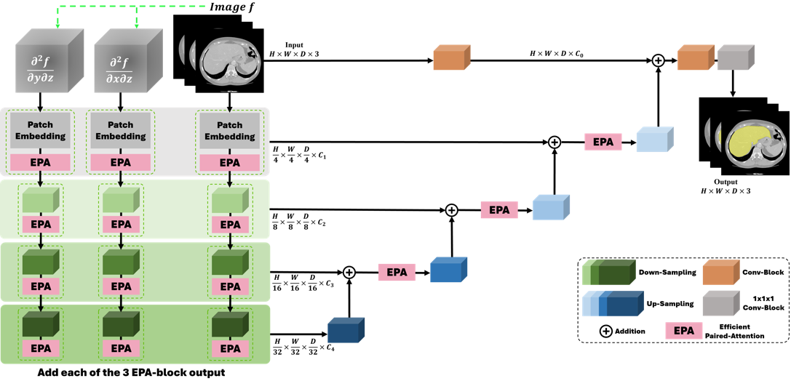
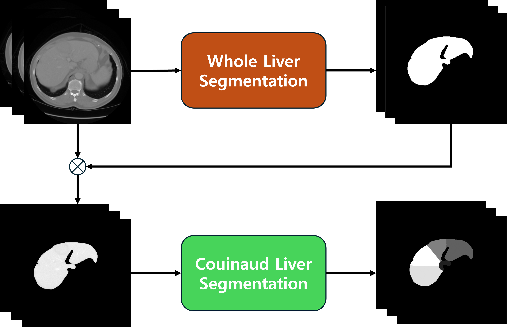

# G-UNETR++: MSD Couinaud segmentation
---
  
  
**🔥G-UNETR++: A gradient-enhanced network for accurate and robust liver segmentation from CT images**   
Paper: [G-UNETR++](#)
  
---
# Requirements
Our code is based on [UNETR++](https://github.com/Amshaker/unetr_plus_plus) code.  
But, we modified the code for easy implementation.
Our GPU is `RTX 3090 GPU`.  
  
## Environment
1. Create and activate conda environment  
```bash
conda create --name gunetr_pp python=3.9
conda activate gunetr_pp
```
  
2. Install pytorch
```bash
# cuda 11.3
conda install pytorch==1.12.0 torchvision==0.13.0 torchaudio==0.12.0 cudatoolkit=11.3 -c pytorch
```
It is important that check your `cuda version`.  
Please, see the [pytorch document](https://pytorch.org/get-started/previous-versions/#v1120).  
  
3. Install other dependencies
```
pip install -r requirements.txt
```
  
---
# Dataset
In paper, we teseted `MSD`.  
  
## Dataset format
```
GUNETR_pplus_LiTS
├── DATASET_Synapse                  
│   ├── unetr_pp_raw
│       ├── unetr_pp_raw_data           
│           ├── Task02_Synapse           
│               ├── Task002_Synapse         
│                   ├── seg_gt
│                       ├── test
│                           ├── hepaticvessel_001.nii.gz
│                           ├── hepaticvessel_004.nii.gz
│                           ├── ...
│                           └── hepaticvessel_455.nii.gz
│                   ├── unetr_pp_Data_plans_v2.1_stage1
│                       ├── test
│                           ├── hepaticvessel_001.nii.gz
│                           ├── hepaticvessel_004.nii.gz
│                           ├── ...
│                           └── hepaticvessel_455.nii.gz
│                   └── unetr_pp_Plansv2.1_plans_3D.pkl
```
MSD dataset: [link](http://medicaldecathlon.com/).
> Our MSD-testset(50) is `1, 4, 9, 10, 11, 13, 15, 21, 27, 44, 50, 52, 53, 62, 66, 69, 71, 75, 82, 89, 91, 92, 101, 116, 117, 124, 136, 140, 147, 171, 179, 183, 213, 215, 229, 245, 265, 269, 275, 287, 305, 307, 359, 375, 377, 399, 425, 441, 445, 455`.  
  
## Make masking files
Please see [whole_liver_segmentation](https://github.com/AI-Medical-Vision/GUNETR_pplus_MSD_Whole).  
  
## Model Checkpoint
```
GUNETR_pplus_LiTS
├── output_synapse                 
│   ├── 3d_fullres
│       ├── Task002_Synapse                   
│           ├── unetr_pp_trainer_synapse__unetr_pp_Plansv2.1        
│               ├── fold_4
│                   ├── validation_raw
│                   ├── model_final_checkpoint.model
│                   └── model_final_checkpoint.model.pkl
```
Couinaud final chekcpoint: [link](https://drive.google.com/file/d/1KxiHo0tSBsaPG3pQK5o68YS1QpsxKpHl/view?usp=sharing).  

---
# Implementation
   
1. Make masking files  
Using [MSD Whole liver segmentation model](https://github.com/AI-Medical-Vision/GUNETR_pplus_MSD_Whole/blob/main/MSD_masking.ipynb).  
  
2. Make whole npy files
```bash
$> python MSD_npy_make.py
```
You select the options, `couinaud`.  
  
3. Evaluation script
```bash
$> cd ./evaluation_scripts
$> sh run_evaluation_synapse.sh
```
You select the options, `couinaud`.  
  
4. Calculation metrics
Please see our [jupyter notebook](https://github.com/AI-Medical-Vision/GUNETR_pplus_MSD_Couinaud/blob/main/Couidnuad_metric.ipynb).  
We implemented all of metric classes.  
> You can control post-processing option through `flag_post = True`.
  
---
# Result
## Couinaud segmentation (MSD)
| Segments | Ours | V-Net | 
| --- | --- | --- | 
| `Seg 1` | **0.8691** | 0.8309 | 
| `Seg 2` | **0.8953** | 0.8603 | 
| `Seg 3`  | 0.7966 | **0.8268** | 
| `Seg 4` | **0.8597** | 0.7700 | 
| `Seg 5` | **0.8131** | 0.7553 | 
| `Seg 6` | 0.7839 | **0.7904** |
| `Seg 7` | **0.8669** | 0.9490 | 
| `Seg 8` | **0.8502** | 0.9490 | 
| `Avg` | **0.8419** | 0.8338 | 
   
---
# References
[UNETR++](https://arxiv.org/abs/2212.04497)   
[V-Net](https://www.mdpi.com/2076-3417/12/7/3247)
  
---
# Citation
```bibtex
@ARTICLE{
  title={G-UNETR++: A gradient-enhanced network for accurate and robust liver segmentation from CT images}, 
  author={Seungyoo Lee, Kyujin Han, Hangyeul Shin, Harin Park, Xiaopeng Yang, Jae Do Yang, Hee Chul Yu, Heecheon You},
  journal={}, 
  year={2024},
  doi={}}
```
